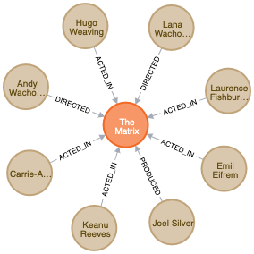
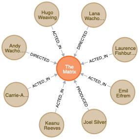
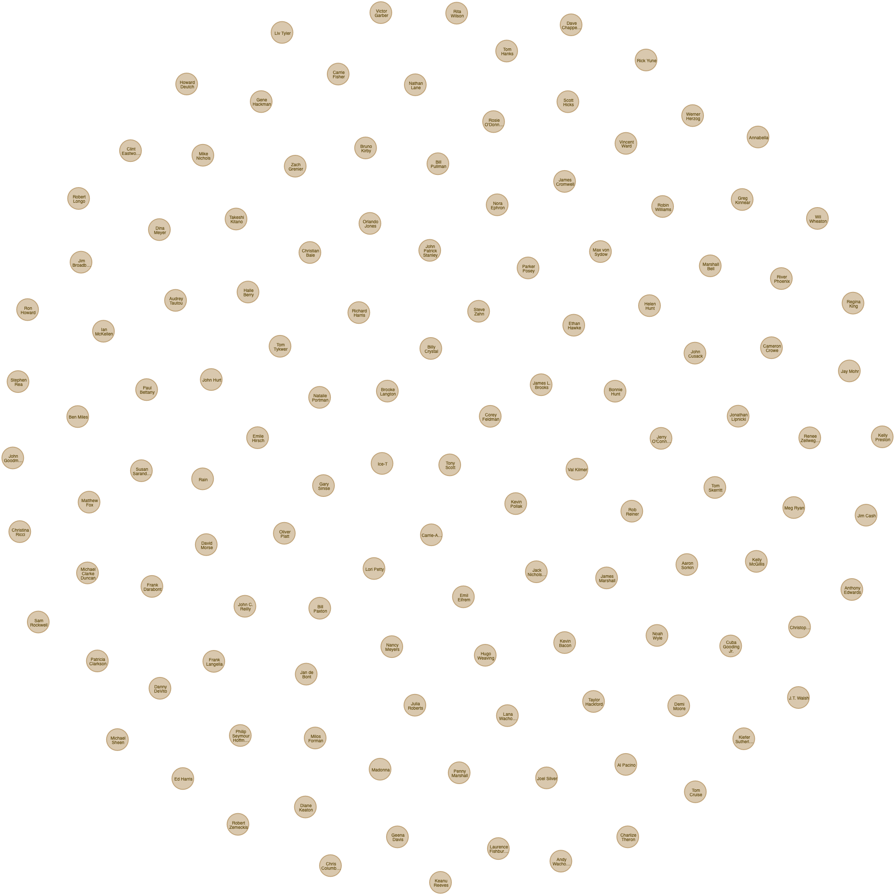

# Assignment A3 | Cypher

By **Stephan Djurhuus**  
Institute **CPHBusiness**  

Education **Software Development**  
Elective **Databases**  
Topic **Graph Databases**  

**1. Create a Movie node for the movie with a title Forrest Gump.**

_cypher_
```sql
CREATE(m:Movie { title:" Forrest Gump" }) RETURN m;
```

_response_
```json
{
    "title": "Forrest Gump"
}
```

**2. Add the following properties to the movie Forrest Gump:**
* released: 1995
* tagline: "Life is like a box of chocolates…​you never know what you’re gonna get."

_cypher_
```sql
MATCH(m:Movie { title:"Forrest Gump" })
SET m.released = 1995, m.tagline = "Life is like a box of chocolates…​you never know what you’re gonna get."
RETURN m;
```

_response_
```json
{
    "title": "Forrest Gump",
    "released": 1995,
    "tagline": "Life is like a box of chocolates…​you never know what you’re gonna get."
}
```

**3. Update the released property of movie Forrest Gump, as it has actually been released in 1994.**

_cypher_
```sql
MATCH(m:Movie { title:"Forrest Gump" })
SET m.released = 1994
RETURN m;
```

_response_
```json
{
    "title": "Forrest Gump",
    "released": 1994,
    "tagline": "Life is like a box of chocolates…​you never know what you’re gonna get."
}
```

**4. Find the movie with the tagline Free your mind.**

_cypher_
```sql
MATCH(m:Movie { tagline:"Free your mind" })
RETURN m;
```

_response_
```json
{
    "title": "the Matrix Reloaded",
    "tagline": "Free your mind",
    "release": 2003
}
```

**5. Retrieve the movie The Matrix and all its relationships.**

_cypher_
```sql
MATCH(m:Movie { title:"The Matrix" })-[r]-(n)
RETURN m, r, n;
```

_response_  


**6. Find the names and relationship type of all people who have any type of relationship to the movie The Matrix.**

_cypher_
```sql
MATCH(m:Movie { title:"The Matrix" })-[r]-(p:Person)
RETURN m, r, p;
```

_response_  


**7. Find all people born in the previous century.**

_cypher_
```sql
MATCH(p:Person)
WHERE p.born < 2000 AND p.born >=1900
RETURN p;
```

_response_  


**8. Find all people who gave the movie The Da Vinci Code a rating of 65, returning their names.**

_cypher_
```sql
MATCH(:Movie {title: "The Da Vinci Code"})-[r:REVIEWED]-(p:Person)
WHERE r.rating = 65
RETURN p.name;
```

_response_
```json
"James Thompson"
```

**9. Find all people who follow Angela Scope and those who Angela Scope follows.**

_cypher_
```sql
MATCH(:Person {name: "Angela Scope"})-[f:FOLLOWS]-(p:Person) 
RETURN p;
```

_response_
```json
"name": "Jessica Thompson",
"name": "Paul Blythe"
```

**10. Find all people who follow anybody who follows Jessica Thompson returning them as nodes.**

_cypher_
```sql
MATCH(:Person {name: "Jessica Thompson"})<-[:FOLLOWS]-(:Person)<-[:FOLLOWS]-(p:Person)
RETURN p;
```

_response_
```json
"name": "Paul Blythe"
```

**11. Tom Hanks hasn’t HELPED Gary Sinise in a research. Remove this property from the relation.**

Cant find the HELPED in any research, so instead of removing it, I will make it so I can remove it afterwords.

_cypher_
```sql
MATCH(tomHanks:Person {name: "Tom Hanks"}), (garySinise:Person {name: "Gary Sinise"}) 
CREATE (tomHanks)-[r:RESEARCH]->(garySinise)
SET r.HELPED = true
RETURN tomHanks, garySinise;
```

_cypher_
```sql
MATCH(tomHanks:Person {name: "Tom Hanks"})-[r:RESEARCH]->(garySinise:Person {name: "Gary Sinise"}) 
REMOVE r.HELPED
RETURN tomHanks, garySinise;
```

_response_  


**12. Delete the whole person-to-person relationship HELPED from the graph.**

_cypher_
```sql
MATCH(tomHanks:Person {name: "Tom Hanks"})-[r:RESEARCH]->(garySinise:Person {name: "Gary Sinise"}) 
DELETE r
RETURN tomHanks, garySinise;
```

_response_  
